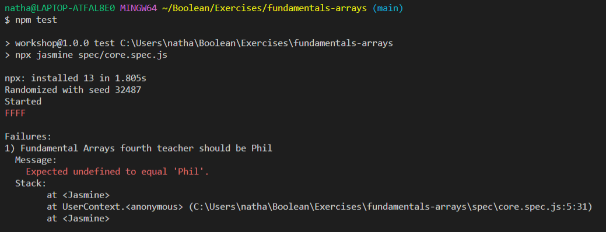
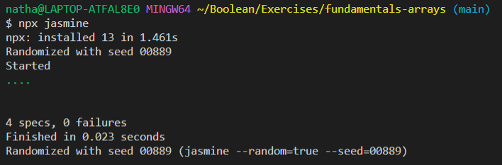

# Programming Fundamentals: Arrays

## Setup

- Fork this repository and clone your forked version to your machine
- Install dependencies by running the command below while in the project's root directory:

`npm ci`

## Instructions

- Read through the numbered comments in `src/core.js` to understand the core requirements of this exercise.

- Write your code directly below the numbered comment.

- Add `console.log`'s to get visibility on your solution and run the file with the command `node src/core.js`

**Example**

```js
// 1. Create a variable named hello with the value 'Hello'
const hello = 'Hello'
console.log(hello)
```

## Running tests

- When ready to test your solution is correct, run the test suite with the command `npm test`
- To begin with, all of the tests will fail. You'll see red `F`'s in your console, like the image below:



- Your solution is complete when the red `F`'s have been replaced with green `.`'s in your console, like the image below:



## Formatting Tests

When you try to `git commit` any work you've staged using `git add`, there is an additional test that runs that checks the formatting of your work against a set of rules we've defined. To run these tests locally use the following:

```sh
$ npx eslint src
```

You will then need to resolve the errors before successfully committing your work. You can also do this automatically with this command - but try to understand what well-formatted code looks like so you don't simply rely on this magic fix!

```
$ npx eslint src --fix
```

NB: If you fix these formatting errors, don't forget to `git add` and then `git commit` your changes before `git push` back to your remote repository

## Extension

- If you finish the core criteria, you can follow the same development process for the `src/extension.js` file
- To run the extension tests, use the command `npm run test-extensions`

## Advanced Extensions

- If you finish the extension criteria, you can follow the same development process for the `src/advanced.js` file
- To run the advanced tests, use the command `npm run test-advanced`
